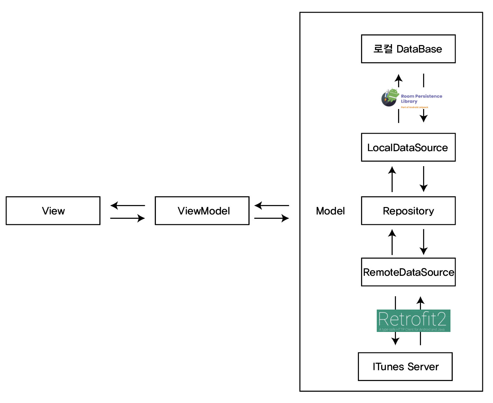
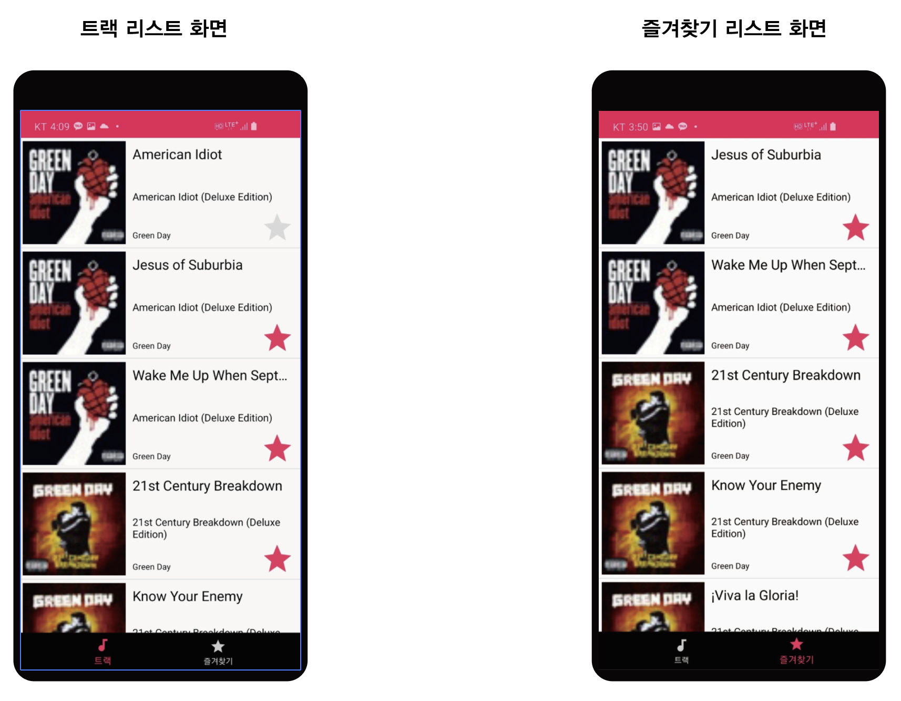

# 왓챠 Android 개발자 과제

## 개요

iTunes search API 를 이용하여 **1.트랙 리스트 화면**, **2. Favorite 트랙 리스트 화면** 을 만들기

## 사용 스택

- 개발환경
  - Android Studio
- 언어
  - Kotlin
- 라이브러리
  - Retrofit2, okhttp interceptor 
    -  ITunes Server에 있는 데이터를 가져오기 위해서 사용
  - RxJava, RxKotlin, RxAndroid 
    - 비동기 처리를 위해 사용
  - Glide 
    - ImgaeView에 url로 이미지를 삽입하기 위해 사용
  - Room 
    - 로컬DB와 연동을 위해 사용
  - ViewModel, LiveData, ktx 
    - ACC ViewModel을 이용하기 위해 사용 
  - Dagger Hilt
    - 결합도를 낮춰주고 보일러플레이트 코드를 줄여주기 위해 DI구현을 돕는 Hilt 사용

## 프로젝트 구조

## 실행 화면

